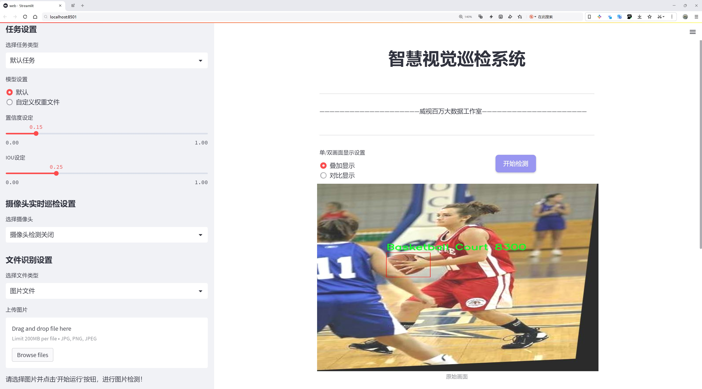
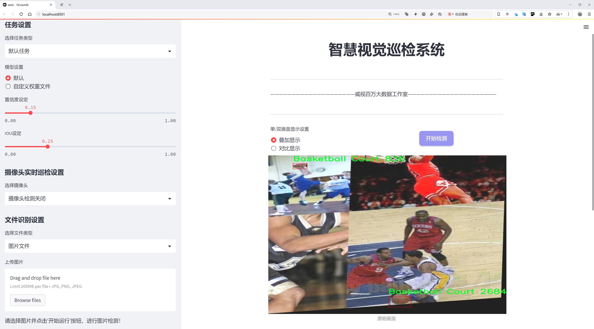
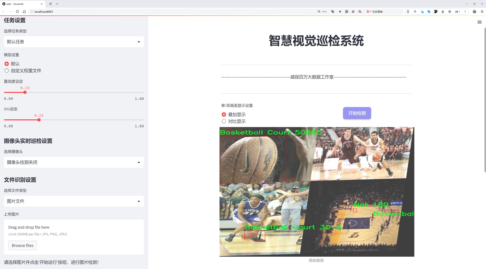
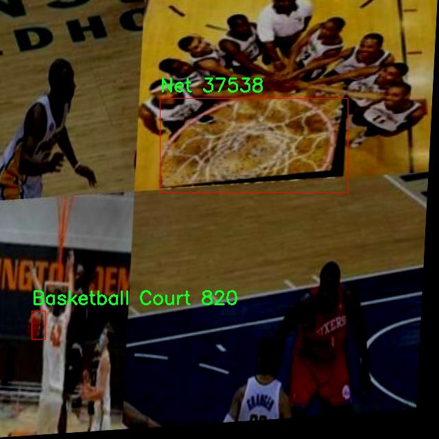
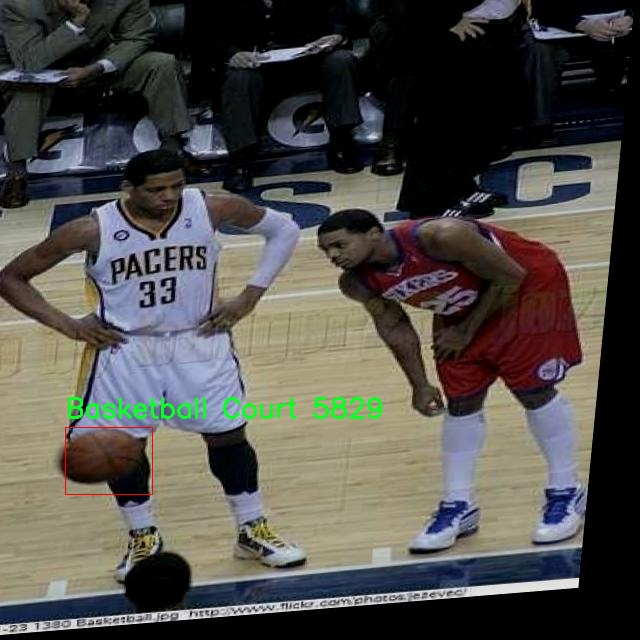
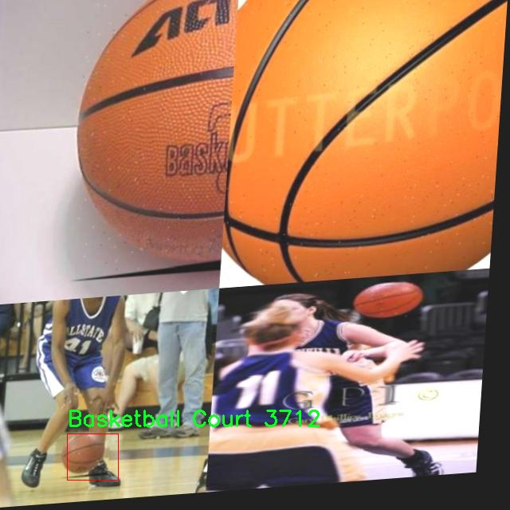
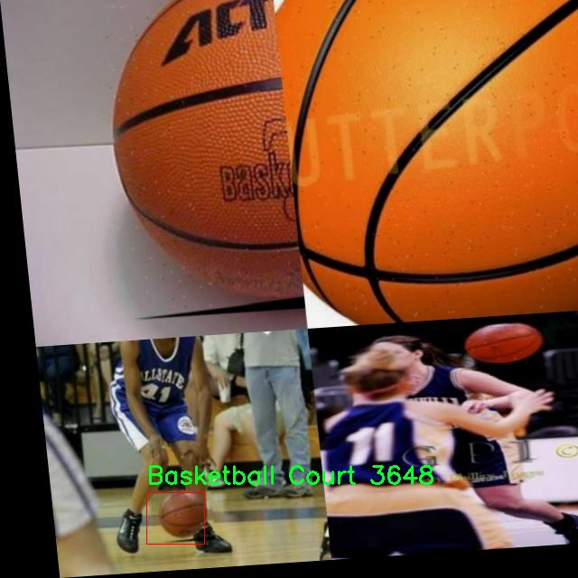
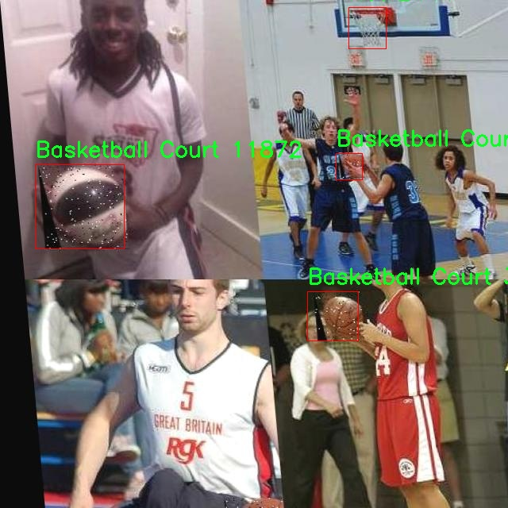

# 篮球场景检测检测系统源码分享
 # [一条龙教学YOLOV8标注好的数据集一键训练_70+全套改进创新点发刊_Web前端展示]

### 1.研究背景与意义

项目参考[AAAI Association for the Advancement of Artificial Intelligence](https://gitee.com/qunshansj/projects)

项目来源[AACV Association for the Advancement of Computer Vision](https://gitee.com/qunmasj/projects)

研究背景与意义

随着计算机视觉技术的快速发展，物体检测在各个领域的应用越来越广泛，尤其是在体育场景分析中，物体检测技术的引入为运动表现评估、战术分析和观众体验提升提供了新的可能性。篮球作为一项全球广受欢迎的运动，其比赛过程中的动态变化和复杂场景为物体检测提出了更高的要求。传统的篮球场景分析方法往往依赖于人工标注和经验判断，效率低下且容易受到主观因素的影响。因此，基于深度学习的自动化检测系统应运而生，成为研究的热点。

本研究旨在基于改进的YOLOv8模型，构建一个高效的篮球场景检测系统，主要针对篮球、篮网和球员三类目标进行检测。我们所使用的数据集包含3809张图像，涵盖了多种比赛场景和角度，确保了模型训练的多样性和鲁棒性。通过对这些图像的深入分析，我们能够提取出篮球比赛中关键的视觉信息，为后续的运动分析和战术研究提供数据支持。

在现有的物体检测模型中，YOLO系列因其高效性和实时性而备受青睐。然而，YOLOv8作为最新版本，虽然在检测精度和速度上都有显著提升，但在特定场景下仍存在一些不足之处。通过对YOLOv8模型的改进，我们希望能够进一步提高其在篮球场景中的检测精度，尤其是在复杂背景和快速运动情况下的表现。改进的方向包括优化特征提取网络、调整锚框设置以及增强数据集的多样性，以提升模型对不同场景的适应能力。

此外，篮球场景检测系统的研究不仅具有学术价值，还具有重要的实际应用意义。通过实现对篮球场景中关键元素的实时检测，教练和运动员可以获得更为精准的数据支持，从而在战术制定和运动训练中做出更为科学的决策。同时，观众在观看比赛时也能够通过增强现实技术获得更丰富的比赛信息，提升观赛体验。综上所述，本研究不仅推动了计算机视觉技术在体育领域的应用，也为未来的智能体育发展奠定了基础。

总之，基于改进YOLOv8的篮球场景检测系统的研究，既是对现有技术的挑战与创新，也是对篮球运动科学研究的一次积极探索。通过深入分析和改进，我们期待能够为篮球运动的训练、比赛和观赏提供更为智能化的解决方案，推动体育科技的进步。

### 2.图片演示







##### 注意：由于此博客编辑较早，上面“2.图片演示”和“3.视频演示”展示的系统图片或者视频可能为老版本，新版本在老版本的基础上升级如下：（实际效果以升级的新版本为准）

  （1）适配了YOLOV8的“目标检测”模型和“实例分割”模型，通过加载相应的权重（.pt）文件即可自适应加载模型。

  （2）支持“图片识别”、“视频识别”、“摄像头实时识别”三种识别模式。

  （3）支持“图片识别”、“视频识别”、“摄像头实时识别”三种识别结果保存导出，解决手动导出（容易卡顿出现爆内存）存在的问题，识别完自动保存结果并导出到tempDir中。

  （4）支持Web前端系统中的标题、背景图等自定义修改，后面提供修改教程。

  另外本项目提供训练的数据集和训练教程,暂不提供权重文件（best.pt）,需要您按照教程进行训练后实现图片演示和Web前端界面演示的效果。

### 3.视频演示

[3.1 视频演示](https://www.bilibili.com/video/BV1Yp4BedERR/)

### 4.数据集信息展示

##### 4.1 本项目数据集详细数据（类别数＆类别名）

nc: 4
names: ['Basketball Court', 'Basketball', 'Net', 'No ball']


##### 4.2 本项目数据集信息介绍

数据集信息展示

在本研究中，我们使用了名为“Basketball and Hoop Detection”的数据集，以支持对篮球场景的检测系统进行改进，特别是针对YOLOv8模型的训练和优化。该数据集专门设计用于捕捉篮球场景中的各种元素，旨在提升计算机视觉技术在体育场景分析中的应用效果。数据集的类别数量为四个，具体类别包括“篮球场”、“篮球”、“篮网”和“无球”，这些类别的选择反映了篮球比赛中关键的视觉特征，有助于系统更准确地识别和理解场景。

首先，篮球场作为主要的检测对象之一，其特征不仅包括场地的颜色和标记，还涉及到场地的布局和结构。数据集中包含了多种不同角度和光照条件下的篮球场图像，这为模型提供了丰富的训练样本，确保其在实际应用中能够适应不同的环境和条件。通过对篮球场的准确检测，系统能够为后续的篮球运动分析提供基础信息，如球员的位置、战术布局等。

其次，篮球作为另一重要类别，其检测不仅限于球的形状和颜色，还包括其在场地上的运动轨迹。数据集中收录了多种情况下篮球的图像，包括静止状态和运动状态。这种多样性使得模型能够学习到篮球在不同场景下的表现特征，从而提高对篮球运动的识别能力。这对于分析比赛中的关键时刻、球员的投篮表现等都具有重要意义。

此外，篮网的检测同样不可忽视。篮网的存在与否直接影响着比赛的结果，因此在数据集中专门设置了“篮网”这一类别。通过对篮网的检测，系统能够判断投篮是否成功，这对于实时比赛分析和战术调整至关重要。数据集中包含了不同角度和距离下的篮网图像，确保模型能够在多种情况下进行准确识别。

最后，“无球”这一类别的设置则是为了帮助模型在场景中进行更全面的理解。无球状态下的场景同样具有重要的分析价值，例如，球员的跑位、战术配合等。通过识别“无球”状态，系统能够更好地理解比赛的动态变化，为教练和分析师提供更深入的洞察。

综上所述，“Basketball and Hoop Detection”数据集为YOLOv8模型的训练提供了丰富而多样的样本，涵盖了篮球场景中的关键元素。通过对这四个类别的深入学习，模型将能够在实际应用中实现高效的篮球场景检测，推动体育分析和智能监控技术的发展。数据集的多样性和针对性使其成为本研究的核心支撑，为改进篮球场景检测系统奠定了坚实的基础。











### 5.全套项目环境部署视频教程（零基础手把手教学）

[5.1 环境部署教程链接（零基础手把手教学）](https://www.ixigua.com/7404473917358506534?logTag=c807d0cbc21c0ef59de5)


[5.2 安装Python虚拟环境创建和依赖库安装视频教程链接（零基础手把手教学）](https://www.ixigua.com/7404474678003106304?logTag=1f1041108cd1f708b01a)

### 6.手把手YOLOV8训练视频教程（零基础小白有手就能学会）

[6.1 手把手YOLOV8训练视频教程（零基础小白有手就能学会）](https://www.ixigua.com/7404477157818401292?logTag=d31a2dfd1983c9668658)

### 7.70+种全套YOLOV8创新点代码加载调参视频教程（一键加载写好的改进模型的配置文件）

[7.1 70+种全套YOLOV8创新点代码加载调参视频教程（一键加载写好的改进模型的配置文件）](https://www.ixigua.com/7404478314661806627?logTag=29066f8288e3f4eea3a4)

### 8.70+种全套YOLOV8创新点原理讲解（非科班也可以轻松写刊发刊，V10版本正在科研待更新）

由于篇幅限制，每个创新点的具体原理讲解就不一一展开，具体见下列网址中的创新点对应子项目的技术原理博客网址【Blog】：


[8.1 70+种全套YOLOV8创新点原理讲解链接](https://gitee.com/qunmasj/good)

### 9.系统功能展示（检测对象为举例，实际内容以本项目数据集为准）

图9.1.系统支持检测结果表格显示

  图9.2.系统支持置信度和IOU阈值手动调节

  图9.3.系统支持自定义加载权重文件best.pt(需要你通过步骤5中训练获得)

  图9.4.系统支持摄像头实时识别

  图9.5.系统支持图片识别

  图9.6.系统支持视频识别

  图9.7.系统支持识别结果文件自动保存

  图9.8.系统支持Excel导出检测结果数据


### 10.原始YOLOV8算法原理

原始YOLOv8算法原理

YOLOv8算法是目标检测领域中的一项重要进展，承载着YOLO系列模型的最新研究成果。该算法的设计理念依然遵循“你只看一次”（You Only Look Once）的原则，通过将目标检测问题转化为回归问题，从而实现快速而高效的检测。YOLOv8在前几代的基础上进行了多项创新和改进，旨在提高模型的准确性、速度和灵活性。

首先，YOLOv8的网络结构可以被分为四个主要部分：输入层、主干网络、颈部网络和头部网络。输入层负责对输入图像进行预处理，通常包括缩放和归一化，以确保输入尺寸符合模型要求。主干网络是YOLOv8的核心部分，负责提取图像特征。该部分采用了卷积操作进行下采样，利用批归一化和SiLUR激活函数来增强特征的表达能力。与YOLOv5相比，YOLOv8在主干网络中引入了C2f模块，这一模块通过跨层分支连接来增强梯度流动，促进特征的有效提取。C2f模块的设计灵感来源于YOLOv7中的E-ELAN结构，能够更好地处理深层网络中的梯度消失问题，从而提升模型的检测性能。

在主干网络的末尾，YOLOv8引入了SPPFl模块，该模块通过三个最大池化层来处理多尺度特征。这一设计使得模型在面对不同尺寸的目标时，能够有效地提取和融合特征，从而提高检测的准确性和鲁棒性。接下来的颈部网络则利用特征金字塔网络（FPN）和路径聚合网络（PAN）结构来融合不同尺度的特征图信息。这一融合过程使得模型能够综合考虑多层次的特征，从而更好地应对复杂场景中的目标检测任务。

YOLOv8的头部网络采用了解耦的检测头结构，这一创新的设计使得模型能够在分类和定位任务中分别进行特征提取。通过两个并行的卷积分支，YOLOv8能够独立计算类别损失和回归损失，从而提高了检测的精度。这种解耦结构的引入，使得模型在处理复杂的目标检测任务时，能够更灵活地适应不同的需求。

在数据预处理方面，YOLOv8延续了YOLOv5的策略，采用了多种数据增强技术，包括马赛克增强、混合增强、空间扰动和颜色扰动等。这些增强手段的引入，能够有效地扩充训练数据集，提升模型的泛化能力。此外，YOLOv8在标签分配策略上进行了创新，采用了动态标签分配策略TOOD，旨在解决正负样本匹配的多尺度分配问题。这一策略的实施，使得模型在训练过程中能够更好地适应数据集的特征，从而提高检测性能。

YOLOv8在损失函数的设计上也进行了优化，分类损失采用了变焦损失（VFL Loss），而回归损失则结合了CIoULoss与DFLLoss。这种设计使得模型在训练过程中能够更好地关注高质量的正样本，同时降低负样本对损失的影响，从而提高整体的检测效果。VFL Loss通过不对称参数对正负样本进行加权，促使模型在训练时更加关注高质量的样本，进而提升模型的平均精度（AP）。

总的来说，YOLOv8算法通过一系列创新和改进，进一步提升了目标检测的性能。其在网络结构、数据预处理、标签分配和损失函数等多个方面的优化，使得YOLOv8不仅在速度上具备优势，更在精度和灵活性上实现了显著提升。这些特性使得YOLOv8成为当前目标检测领域中的一款先进模型，广泛应用于自动驾驶、安防监控、智能交通等多个领域。随着YOLOv8的不断发展和完善，未来的目标检测任务将会更加高效和精准。


### 11.项目核心源码讲解（再也不用担心看不懂代码逻辑）

#### 11.1 ui.py

以下是代码的核心部分，并附上详细的中文注释：

```python
import sys
import subprocess

def run_script(script_path):
    """
    使用当前 Python 环境运行指定的脚本。

    Args:
        script_path (str): 要运行的脚本路径

    Returns:
        None
    """
    # 获取当前 Python 解释器的路径
    python_path = sys.executable

    # 构建运行命令，使用 streamlit 运行指定的脚本
    command = f'"{python_path}" -m streamlit run "{script_path}"'

    # 执行命令
    result = subprocess.run(command, shell=True)
    # 检查命令执行结果，如果返回码不为0，表示执行出错
    if result.returncode != 0:
        print("脚本运行出错。")

# 实例化并运行应用
if __name__ == "__main__":
    # 指定要运行的脚本路径
    script_path = "web.py"  # 这里可以直接指定脚本名，假设它在当前目录下

    # 调用函数运行脚本
    run_script(script_path)
```

### 代码核心部分分析：
1. **导入模块**：
   - `sys`：用于获取当前 Python 解释器的路径。
   - `subprocess`：用于执行外部命令。

2. **`run_script` 函数**：
   - 接收一个参数 `script_path`，表示要运行的 Python 脚本的路径。
   - 使用 `sys.executable` 获取当前 Python 解释器的路径。
   - 构建一个命令字符串，使用 `streamlit` 模块运行指定的脚本。
   - 使用 `subprocess.run` 执行命令，并检查返回码以判断脚本是否成功运行。

3. **主程序块**：
   - 当脚本作为主程序运行时，指定要运行的脚本路径（这里是 `web.py`）。
   - 调用 `run_script` 函数来执行指定的脚本。

### 注意事项：
- `abs_path` 函数在这里被省略，假设脚本路径可以直接使用。
- `subprocess.run` 的 `shell=True` 参数允许在 shell 中执行命令，这在某些情况下可能存在安全隐患，需谨慎使用。

这个程序文件名为 `ui.py`，它的主要功能是通过当前的 Python 环境来运行一个指定的脚本。首先，文件导入了必要的模块，包括 `sys`、`os` 和 `subprocess`，这些模块提供了与系统交互的功能。特别是 `subprocess` 模块用于在 Python 中执行外部命令。

在 `run_script` 函数中，程序接受一个参数 `script_path`，这是要运行的脚本的路径。函数首先获取当前 Python 解释器的路径，使用 `sys.executable` 来实现。接着，构建一个命令字符串，这个命令会调用 `streamlit` 模块来运行指定的脚本。`streamlit` 是一个用于构建数据应用的库，通常用于快速创建 Web 应用。

然后，程序使用 `subprocess.run` 方法来执行这个命令，`shell=True` 参数允许在 shell 中执行命令。执行后，程序检查返回码，如果返回码不为零，表示脚本运行过程中出现了错误，程序会打印出“脚本运行出错”的信息。

在文件的最后部分，使用 `if __name__ == "__main__":` 语句来确保只有在直接运行这个文件时才会执行后面的代码。此时，程序指定了一个脚本路径，这里是通过 `abs_path` 函数获取的 `web.py` 的绝对路径。最后，调用 `run_script` 函数来运行这个脚本。

总的来说，这个程序的目的是提供一个简单的接口，通过它可以方便地运行一个 Streamlit 应用，具体是通过调用 `web.py` 文件来实现的。

#### 11.2 code\ultralytics\solutions\heatmap.py

以下是代码中最核心的部分，并附上详细的中文注释：

```python
import cv2
import numpy as np
from collections import defaultdict
from shapely.geometry import LineString, Point, Polygon

class Heatmap:
    """用于实时视频流中绘制热图的类，基于对象的轨迹进行绘制。"""

    def __init__(self):
        """初始化热图类，设置默认的可视化、图像和热图参数。"""
        # 可视化信息
        self.annotator = None  # 注释器，用于在图像上绘制
        self.view_img = False  # 是否显示图像
        self.shape = "circle"  # 热图形状，默认为圆形

        # 图像信息
        self.imw = None  # 图像宽度
        self.imh = None  # 图像高度
        self.im0 = None  # 原始图像
        self.view_in_counts = True  # 是否显示进入计数
        self.view_out_counts = True  # 是否显示离开计数

        # 热图的颜色映射和热图数组
        self.colormap = None  # 热图颜色映射
        self.heatmap = None  # 热图数据
        self.heatmap_alpha = 0.5  # 热图透明度

        # 预测/跟踪信息
        self.boxes = None  # 检测框
        self.track_ids = None  # 跟踪ID
        self.clss = None  # 类别
        self.track_history = defaultdict(list)  # 跟踪历史记录

        # 区域和线的信息
        self.count_reg_pts = None  # 计数区域的点
        self.counting_region = None  # 计数区域
        self.line_dist_thresh = 15  # 线计数的距离阈值
        self.region_thickness = 5  # 区域厚度
        self.region_color = (255, 0, 255)  # 区域颜色

        # 对象计数信息
        self.in_counts = 0  # 进入计数
        self.out_counts = 0  # 离开计数
        self.counting_list = []  # 正在计数的对象列表
        self.count_txt_thickness = 0  # 计数文本厚度
        self.count_txt_color = (0, 0, 0)  # 计数文本颜色
        self.count_color = (255, 255, 255)  # 计数背景颜色

        # 衰减因子
        self.decay_factor = 0.99  # 热图衰减因子

    def set_args(self, imw, imh, colormap=cv2.COLORMAP_JET, heatmap_alpha=0.5, view_img=False,
                 view_in_counts=True, view_out_counts=True, count_reg_pts=None,
                 count_txt_thickness=2, count_txt_color=(0, 0, 0), count_color=(255, 255, 255),
                 count_reg_color=(255, 0, 255), region_thickness=5, line_dist_thresh=15,
                 decay_factor=0.99, shape="circle"):
        """
        配置热图的颜色映射、宽度、高度和显示参数。

        参数:
            imw (int): 帧的宽度。
            imh (int): 帧的高度。
            colormap (cv2.COLORMAP): 要设置的颜色映射。
            heatmap_alpha (float): 热图显示的透明度。
            view_img (bool): 是否显示帧。
            view_in_counts (bool): 是否在视频流中显示进入计数。
            view_out_counts (bool): 是否在视频流中显示离开计数。
            count_reg_pts (list): 对象计数区域的点。
            count_txt_thickness (int): 对象计数显示的文本厚度。
            count_txt_color (RGB color): 计数文本颜色值。
            count_color (RGB color): 计数文本背景颜色值。
            count_reg_color (RGB color): 对象计数区域的颜色。
            region_thickness (int): 对象计数区域的厚度。
            line_dist_thresh (int): 线计数的欧几里得距离阈值。
            decay_factor (float): 对象经过后移除热图区域的值。
            shape (str): 热图形状，支持矩形或圆形。
        """
        self.imw = imw
        self.imh = imh
        self.heatmap_alpha = heatmap_alpha
        self.view_img = view_img
        self.view_in_counts = view_in_counts
        self.view_out_counts = view_out_counts
        self.colormap = colormap

        # 区域和线的选择
        if count_reg_pts is not None:
            if len(count_reg_pts) == 2:
                self.count_reg_pts = count_reg_pts
                self.counting_region = LineString(count_reg_pts)  # 线计数
            elif len(count_reg_pts) == 4:
                self.count_reg_pts = count_reg_pts
                self.counting_region = Polygon(self.count_reg_pts)  # 区域计数
            else:
                print("区域或线的点无效，支持2或4个点")
                self.counting_region = Polygon([(20, 400), (1260, 400)])  # 默认线

        # 初始化热图
        self.heatmap = np.zeros((int(self.imh), int(self.imw)), dtype=np.float32)

        self.count_txt_thickness = count_txt_thickness
        self.count_txt_color = count_txt_color
        self.count_color = count_color
        self.region_color = count_reg_color
        self.region_thickness = region_thickness
        self.decay_factor = decay_factor
        self.line_dist_thresh = line_dist_thresh
        self.shape = shape

    def extract_results(self, tracks):
        """
        从提供的数据中提取结果。

        参数:
            tracks (list): 从对象跟踪过程中获得的轨迹列表。
        """
        self.boxes = tracks[0].boxes.xyxy.cpu()  # 获取检测框
        self.clss = tracks[0].boxes.cls.cpu().tolist()  # 获取类别
        self.track_ids = tracks[0].boxes.id.int().cpu().tolist()  # 获取跟踪ID

    def generate_heatmap(self, im0, tracks):
        """
        根据跟踪数据生成热图。

        参数:
            im0 (nd array): 图像。
            tracks (list): 从对象跟踪过程中获得的轨迹列表。
        """
        self.im0 = im0  # 保存原始图像
        if tracks[0].boxes.id is None:
            if self.view_img:
                self.display_frames()  # 显示帧
            return

        self.heatmap *= self.decay_factor  # 应用衰减因子
        self.extract_results(tracks)  # 提取跟踪结果

        for box, track_id in zip(self.boxes, self.track_ids):
            # 根据检测框更新热图
            self.heatmap[int(box[1]):int(box[3]), int(box[0]):int(box[2])] += 2

            # 记录跟踪历史
            track_line = self.track_history[track_id]
            track_line.append((float((box[0] + box[2]) / 2), float((box[1] + box[3]) / 2)))
            if len(track_line) > 30:
                track_line.pop(0)  # 保持历史记录的长度

            # 计数逻辑
            if self.counting_region.contains(Point(track_line[-1])) and track_id not in self.counting_list:
                self.counting_list.append(track_id)
                if box[0] < self.counting_region.centroid.x:
                    self.out_counts += 1  # 离开计数
                else:
                    self.in_counts += 1  # 进入计数

        # 归一化热图并应用颜色映射
        heatmap_normalized = cv2.normalize(self.heatmap, None, 0, 255, cv2.NORM_MINMAX)
        heatmap_colored = cv2.applyColorMap(heatmap_normalized.astype(np.uint8), self.colormap)

        # 将热图与原始图像结合
        self.im0 = cv2.addWeighted(self.im0, 1 - self.heatmap_alpha, heatmap_colored, self.heatmap_alpha, 0)

        if self.view_img:
            self.display_frames()  # 显示帧

        return self.im0

    def display_frames(self):
        """显示帧。"""
        cv2.imshow("Ultralytics Heatmap", self.im0)  # 显示热图

        if cv2.waitKey(1) & 0xFF == ord("q"):
            return  # 按下 'q' 键退出
```

### 代码核心部分解释：
1. **Heatmap类**：该类用于处理实时视频流中的热图生成，主要依赖于对象的轨迹。
2. **初始化方法**：设置热图的基本参数，包括可视化、图像信息、热图数组等。
3. **set_args方法**：用于配置热图的显示参数，包括宽度、高度、颜色映射、计数区域等。
4. **extract_results方法**：从跟踪数据中提取检测框、类别和跟踪ID。
5. **generate_heatmap方法**：根据跟踪数据生成热图，更新热图数据，并进行对象计数。
6. **display_frames方法**：用于显示当前帧图像。

这个程序文件定义了一个名为 `Heatmap` 的类，用于在实时视频流中基于物体轨迹绘制热图。程序的主要功能包括初始化热图参数、提取跟踪结果、生成热图以及显示处理后的图像。

在 `__init__` 方法中，类的实例被初始化，设置了一些默认值，包括视觉信息、图像信息、热图参数、跟踪信息、区域和线的信息、物体计数信息以及衰减因子。特别地，使用 `defaultdict` 来存储跟踪历史，以便于后续的计算。

`set_args` 方法用于配置热图的各种参数，包括图像的宽度和高度、热图的颜色映射、透明度、是否显示图像、计数区域的点、文本的厚度和颜色等。根据提供的计数区域点的数量，程序会判断是使用线计数器还是区域计数器，并初始化相应的几何形状。

`extract_results` 方法从给定的跟踪数据中提取框的位置、类别和跟踪ID。

`generate_heatmap` 方法是程序的核心，接收图像和跟踪数据，生成热图。首先，它会根据衰减因子更新热图，然后提取跟踪结果。接着，如果设置了计数区域，程序会绘制该区域，并根据每个物体的框位置更新热图。根据物体的轨迹，程序会判断物体是否进入或离开计数区域，并更新相应的计数。

在热图生成的最后，程序会对热图进行归一化处理，并将其与原始图像结合。根据用户的选择，程序会显示进入和离开的计数，并将其标注在图像上。最终，处理后的图像会被返回。

`display_frames` 方法用于显示当前帧图像，用户可以通过按下 "q" 键退出显示。

整个程序的结构清晰，功能模块化，便于扩展和维护。通过热图的可视化，用户可以直观地了解物体在视频流中的分布情况及其动态变化。

#### 11.3 70+种YOLOv8算法改进源码大全和调试加载训练教程（非必要）\ultralytics\models\sam\modules\tiny_encoder.py

以下是代码中最核心的部分，并附上详细的中文注释：

```python
import torch
import torch.nn as nn
import torch.nn.functional as F

class Conv2d_BN(torch.nn.Sequential):
    """一个顺序容器，执行2D卷积，后接批量归一化。"""

    def __init__(self, in_channels, out_channels, kernel_size=1, stride=1, padding=0, dilation=1, groups=1, bn_weight_init=1):
        """初始化卷积层和批量归一化层。"""
        super().__init__()
        # 添加卷积层
        self.add_module('c', torch.nn.Conv2d(in_channels, out_channels, kernel_size, stride, padding, dilation, groups, bias=False))
        # 添加批量归一化层
        bn = torch.nn.BatchNorm2d(out_channels)
        # 初始化批量归一化的权重和偏置
        torch.nn.init.constant_(bn.weight, bn_weight_init)
        torch.nn.init.constant_(bn.bias, 0)
        self.add_module('bn', bn)

class PatchEmbed(nn.Module):
    """将图像嵌入为补丁，并将其投影到指定的嵌入维度。"""

    def __init__(self, in_chans, embed_dim, resolution, activation):
        """初始化PatchEmbed类，指定输入通道、嵌入维度、分辨率和激活函数。"""
        super().__init__()
        img_size = (resolution, resolution)  # 假设输入图像为正方形
        self.patches_resolution = (img_size[0] // 4, img_size[1] // 4)  # 每个补丁的分辨率
        self.num_patches = self.patches_resolution[0] * self.patches_resolution[1]  # 总补丁数
        self.in_chans = in_chans
        self.embed_dim = embed_dim
        n = embed_dim
        # 定义嵌入序列
        self.seq = nn.Sequential(
            Conv2d_BN(in_chans, n // 2, 3, 2, 1),  # 第一个卷积层
            activation(),  # 激活函数
            Conv2d_BN(n // 2, n, 3, 2, 1),  # 第二个卷积层
        )

    def forward(self, x):
        """将输入张量x通过PatchEmbed模型的操作序列。"""
        return self.seq(x)

class Attention(nn.Module):
    """多头注意力模块，支持空间感知，应用基于空间分辨率的注意力偏置。"""

    def __init__(self, dim, key_dim, num_heads=8, attn_ratio=4, resolution=(14, 14)):
        """初始化注意力模块。"""
        super().__init__()
        assert isinstance(resolution, tuple) and len(resolution) == 2  # 确保分辨率是二元组
        self.num_heads = num_heads
        self.scale = key_dim ** -0.5  # 缩放因子
        self.key_dim = key_dim
        self.d = int(attn_ratio * key_dim)  # 值向量的维度
        self.attn_ratio = attn_ratio

        # 定义层归一化和线性层
        self.norm = nn.LayerNorm(dim)
        self.qkv = nn.Linear(dim, dim * 3)  # 生成查询、键、值的线性层
        self.proj = nn.Linear(self.d * num_heads, dim)  # 输出线性层

    def forward(self, x):
        """执行前向传播，计算注意力输出。"""
        B, N, _ = x.shape  # B: 批量大小, N: 特征数量, C: 通道数

        # 归一化输入
        x = self.norm(x)

        # 计算查询、键、值
        qkv = self.qkv(x).view(B, N, 3, self.num_heads, -1).transpose(2, 3)  # (B, N, 3, num_heads, key_dim)
        q, k, v = qkv.unbind(2)  # 分离查询、键、值

        # 计算注意力
        attn = (q @ k.transpose(-2, -1)) * self.scale  # 计算注意力得分
        attn = attn.softmax(dim=-1)  # 应用softmax

        # 计算加权和
        x = (attn @ v).transpose(1, 2).reshape(B, N, -1)  # 计算输出
        return self.proj(x)  # 投影到原始维度

class TinyViT(nn.Module):
    """TinyViT架构，用于视觉任务。"""

    def __init__(self, img_size=224, in_chans=3, num_classes=1000, embed_dims=[96, 192, 384, 768], depths=[2, 2, 6, 2], num_heads=[3, 6, 12, 24]):
        """初始化TinyViT模型。"""
        super().__init__()
        self.img_size = img_size
        self.num_classes = num_classes

        # 初始化补丁嵌入层
        self.patch_embed = PatchEmbed(in_chans=in_chans, embed_dim=embed_dims[0], resolution=img_size, activation=nn.GELU)

        # 构建层
        self.layers = nn.ModuleList()
        for i_layer in range(len(depths)):
            layer = BasicLayer(dim=embed_dims[i_layer], input_resolution=(img_size // (2 ** i_layer), img_size // (2 ** i_layer)), depth=depths[i_layer], num_heads=num_heads[i_layer])
            self.layers.append(layer)

        # 分类头
        self.head = nn.Linear(embed_dims[-1], num_classes) if num_classes > 0 else nn.Identity()

    def forward(self, x):
        """执行前向传播，经过所有层，返回最终输出。"""
        x = self.patch_embed(x)  # 通过补丁嵌入层
        for layer in self.layers:
            x = layer(x)  # 通过每一层
        return self.head(x)  # 通过分类头
```

### 代码核心部分解释：
1. **Conv2d_BN**: 这个类定义了一个卷积层后接批量归一化的结构，常用于卷积神经网络中，以提高训练的稳定性和收敛速度。
2. **PatchEmbed**: 这个类将输入图像分割成小补丁，并将这些补丁投影到一个高维空间中，适用于视觉变换器架构。
3. **Attention**: 这是一个多头注意力机制的实现，能够捕捉输入特征之间的关系，并在处理时考虑空间信息。
4. **TinyViT**: 这是整个模型的主体，负责构建网络的层次结构，并定义前向传播过程。

这些类和方法共同构成了TinyViT模型的基础架构，适用于图像分类等视觉任务。

这个程序文件实现了一个名为TinyViT的视觉模型架构，主要用于图像处理任务。该模型结合了卷积神经网络（CNN）和自注意力机制，灵感来源于LeViT和Swin Transformer。文件中包含多个类，每个类负责模型的不同组成部分。

首先，`Conv2d_BN`类定义了一个卷积层，后接批量归一化。它通过初始化卷积层和批量归一化层，并设置权重和偏置的初始值来构建一个基本的卷积模块。

接下来，`PatchEmbed`类负责将输入图像分割成小块（patches），并将这些小块投影到指定的嵌入维度。该类的构造函数接受输入通道数、嵌入维度、图像分辨率和激活函数，并通过一系列卷积和激活操作来实现图像的嵌入。

`MBConv`类实现了移动反向瓶颈卷积层，这是EfficientNet架构的一部分。它通过一系列卷积层和激活函数来处理输入数据，并使用短路连接来增强模型的表现。

`PatchMerging`类用于合并特征图中的相邻小块，并将其投影到新的维度。这一过程有助于减少特征图的尺寸并提取更高层次的特征。

`ConvLayer`类是一个卷积层的容器，包含多个MBConv层，并可以选择性地进行下采样。它还支持梯度检查点以节省内存。

`Mlp`类实现了多层感知机（MLP），用于处理输入特征并进行非线性变换。它包含层归一化和两个全连接层。

`Attention`类实现了多头自注意力机制，支持空间感知。它通过计算查询、键和值的线性变换来生成注意力权重，并将其应用于输入特征。

`TinyViTBlock`类结合了自注意力和局部卷积操作，形成TinyViT的基本构建块。它在输入特征上应用注意力机制，并通过局部卷积来增强特征表示。

`BasicLayer`类是TinyViT架构中的一个基本层，包含多个TinyViT块，并可以选择性地进行下采样。

`LayerNorm2d`类实现了2D层归一化，确保在处理特征图时能够稳定训练过程。

最后，`TinyViT`类是整个模型的主类，负责初始化模型的各个层，并定义前向传播的过程。它接受输入图像的大小、通道数、类别数、嵌入维度、深度、注意力头数等参数，构建出一个灵活的TinyViT模型。

总体而言，这个文件实现了一个高效的视觉模型架构，结合了卷积和自注意力机制，适用于各种视觉任务。通过模块化的设计，模型的各个部分可以灵活组合和调整，以适应不同的应用需求。

#### 11.4 code\ultralytics\models\rtdetr\train.py

以下是经过简化和注释的核心代码部分：

```python
# 导入必要的库
from copy import copy
import torch
from ultralytics.models.yolo.detect import DetectionTrainer
from ultralytics.nn.tasks import RTDETRDetectionModel
from ultralytics.utils import RANK, colorstr
from .val import RTDETRDataset, RTDETRValidator

class RTDETRTrainer(DetectionTrainer):
    """
    RT-DETR模型的训练类，继承自YOLO的DetectionTrainer类。
    RT-DETR是百度开发的实时目标检测模型，利用视觉变换器，具备IoU感知查询选择和可调的推理速度。
    """

    def get_model(self, cfg=None, weights=None, verbose=True):
        """
        初始化并返回一个用于目标检测任务的RT-DETR模型。

        参数:
            cfg (dict, optional): 模型配置，默认为None。
            weights (str, optional): 预训练模型权重的路径，默认为None。
            verbose (bool): 是否详细日志记录，默认为True。

        返回:
            (RTDETRDetectionModel): 初始化后的模型。
        """
        # 创建RT-DETR检测模型
        model = RTDETRDetectionModel(cfg, nc=self.data["nc"], verbose=verbose and RANK == -1)
        # 如果提供了权重，则加载权重
        if weights:
            model.load(weights)
        return model

    def build_dataset(self, img_path, mode="val", batch=None):
        """
        构建并返回用于训练或验证的RT-DETR数据集。

        参数:
            img_path (str): 包含图像的文件夹路径。
            mode (str): 数据集模式，'train'或'val'。
            batch (int, optional): 矩形训练的批量大小，默认为None。

        返回:
            (RTDETRDataset): 特定模式的数据集对象。
        """
        # 创建RT-DETR数据集
        return RTDETRDataset(
            img_path=img_path,
            imgsz=self.args.imgsz,
            batch_size=batch,
            augment=mode == "train",  # 训练模式下进行数据增强
            hyp=self.args,
            rect=False,
            cache=self.args.cache or None,
            prefix=colorstr(f"{mode}: "),  # 添加模式前缀
            data=self.data,
        )

    def get_validator(self):
        """
        返回适合RT-DETR模型验证的检测验证器。

        返回:
            (RTDETRValidator): 模型验证器对象。
        """
        self.loss_names = "giou_loss", "cls_loss", "l1_loss"  # 定义损失名称
        return RTDETRValidator(self.test_loader, save_dir=self.save_dir, args=copy(self.args))

    def preprocess_batch(self, batch):
        """
        预处理一批图像。将图像缩放并转换为浮点格式。

        参数:
            batch (dict): 包含一批图像、边界框和标签的字典。

        返回:
            (dict): 预处理后的批次。
        """
        # 调用父类的预处理方法
        batch = super().preprocess_batch(batch)
        bs = len(batch["img"])  # 批次大小
        batch_idx = batch["batch_idx"]  # 批次索引
        gt_bbox, gt_class = [], []  # 初始化真实边界框和类别列表
        
        # 遍历每个图像，提取对应的边界框和类别
        for i in range(bs):
            gt_bbox.append(batch["bboxes"][batch_idx == i].to(batch_idx.device))  # 获取当前图像的边界框
            gt_class.append(batch["cls"][batch_idx == i].to(device=batch_idx.device, dtype=torch.long))  # 获取当前图像的类别
        return batch  # 返回预处理后的批次
```

### 代码注释说明：
1. **导入部分**：导入了必要的库和模块，以便后续使用。
2. **RTDETRTrainer类**：该类继承自YOLO的DetectionTrainer，专门用于RT-DETR模型的训练。
3. **get_model方法**：用于初始化RT-DETR模型，支持加载预训练权重。
4. **build_dataset方法**：构建训练或验证数据集，支持数据增强。
5. **get_validator方法**：返回适合RT-DETR的验证器，定义了损失名称。
6. **preprocess_batch方法**：对输入的图像批次进行预处理，提取边界框和类别信息。

这个程序文件是一个用于训练RT-DETR模型的Python脚本，属于Ultralytics YOLO项目的一部分。RT-DETR是百度开发的一种实时目标检测模型，结合了视觉变换器（Vision Transformers）和一些特定的功能，如IoU感知查询选择和可调的推理速度。该文件定义了一个名为`RTDETRTrainer`的类，继承自YOLO的`DetectionTrainer`类，以适应RT-DETR模型的特性和架构。

在类的文档字符串中，提到了一些注意事项，例如RT-DETR中使用的`F.grid_sample`不支持`deterministic=True`参数，以及AMP（自动混合精度）训练可能导致NaN输出和在二分图匹配过程中出现错误。

`RTDETRTrainer`类中有几个重要的方法：

1. `get_model`方法用于初始化并返回一个RT-DETR模型。它接受模型配置和预训练权重的路径作为参数，并返回一个初始化的RTDETRDetectionModel实例。

2. `build_dataset`方法用于构建并返回一个RT-DETR数据集，支持训练和验证模式。它接受图像路径、模式（训练或验证）和批量大小作为参数，返回一个RTDETRDataset对象。

3. `get_validator`方法返回一个适合RT-DETR模型验证的检测验证器（DetectionValidator）。在这个方法中，还定义了损失名称，包括"giou_loss"、"cls_loss"和"l1_loss"。

4. `preprocess_batch`方法用于预处理一批图像，将图像缩放并转换为浮点格式。它接受一个包含图像、边界框和标签的字典作为参数，并返回预处理后的批次。

总的来说，这个文件为RT-DETR模型的训练提供了必要的框架和功能，允许用户通过简单的接口进行模型的训练和验证。

#### 11.5 train.py

以下是代码中最核心的部分，并附上详细的中文注释：

```python
class DetectionTrainer(BaseTrainer):
    """
    DetectionTrainer类，继承自BaseTrainer类，用于基于检测模型的训练。
    """

    def build_dataset(self, img_path, mode="train", batch=None):
        """
        构建YOLO数据集。

        参数:
            img_path (str): 包含图像的文件夹路径。
            mode (str): 模式，`train`表示训练模式，`val`表示验证模式，用户可以为每种模式自定义不同的数据增强。
            batch (int, optional): 批次大小，仅用于`rect`模式。默认为None。
        """
        gs = max(int(de_parallel(self.model).stride.max() if self.model else 0), 32)
        return build_yolo_dataset(self.args, img_path, batch, self.data, mode=mode, rect=mode == "val", stride=gs)

    def get_dataloader(self, dataset_path, batch_size=16, rank=0, mode="train"):
        """构造并返回数据加载器。"""
        assert mode in ["train", "val"]  # 确保模式是训练或验证
        with torch_distributed_zero_first(rank):  # 仅在DDP中初始化数据集*.cache一次
            dataset = self.build_dataset(dataset_path, mode, batch_size)  # 构建数据集
        shuffle = mode == "train"  # 训练模式下打乱数据
        if getattr(dataset, "rect", False) and shuffle:
            LOGGER.warning("WARNING ⚠️ 'rect=True'与DataLoader的shuffle不兼容，设置shuffle=False")
            shuffle = False
        workers = self.args.workers if mode == "train" else self.args.workers * 2  # 根据模式设置工作线程数
        return build_dataloader(dataset, batch_size, workers, shuffle, rank)  # 返回数据加载器

    def preprocess_batch(self, batch):
        """对一批图像进行预处理，包括缩放和转换为浮点数。"""
        batch["img"] = batch["img"].to(self.device, non_blocking=True).float() / 255  # 将图像转换为浮点数并归一化
        if self.args.multi_scale:  # 如果启用多尺度
            imgs = batch["img"]
            sz = (
                random.randrange(self.args.imgsz * 0.5, self.args.imgsz * 1.5 + self.stride)
                // self.stride
                * self.stride
            )  # 随机选择一个尺寸
            sf = sz / max(imgs.shape[2:])  # 计算缩放因子
            if sf != 1:  # 如果缩放因子不为1
                ns = [
                    math.ceil(x * sf / self.stride) * self.stride for x in imgs.shape[2:]
                ]  # 计算新的形状
                imgs = nn.functional.interpolate(imgs, size=ns, mode="bilinear", align_corners=False)  # 进行插值
            batch["img"] = imgs  # 更新批次图像
        return batch

    def get_model(self, cfg=None, weights=None, verbose=True):
        """返回YOLO检测模型。"""
        model = DetectionModel(cfg, nc=self.data["nc"], verbose=verbose and RANK == -1)  # 创建检测模型
        if weights:
            model.load(weights)  # 加载权重
        return model

    def get_validator(self):
        """返回YOLO模型验证器。"""
        self.loss_names = "box_loss", "cls_loss", "dfl_loss"  # 定义损失名称
        return yolo.detect.DetectionValidator(
            self.test_loader, save_dir=self.save_dir, args=copy(self.args), _callbacks=self.callbacks
        )  # 返回验证器

    def plot_training_samples(self, batch, ni):
        """绘制带有注释的训练样本。"""
        plot_images(
            images=batch["img"],
            batch_idx=batch["batch_idx"],
            cls=batch["cls"].squeeze(-1),
            bboxes=batch["bboxes"],
            paths=batch["im_file"],
            fname=self.save_dir / f"train_batch{ni}.jpg",
            on_plot=self.on_plot,
        )  # 绘制图像并保存

    def plot_metrics(self):
        """从CSV文件中绘制指标。"""
        plot_results(file=self.csv, on_plot=self.on_plot)  # 保存结果图
```

### 代码核心部分说明：
1. **DetectionTrainer类**：这是一个用于训练YOLO检测模型的类，继承自基础训练类`BaseTrainer`。
2. **build_dataset方法**：构建YOLO数据集，处理图像路径和数据增强模式。
3. **get_dataloader方法**：创建数据加载器，负责将数据集分批次加载到模型中。
4. **preprocess_batch方法**：对输入的图像批次进行预处理，包括归一化和多尺度调整。
5. **get_model方法**：返回一个YOLO检测模型实例，并可选择加载预训练权重。
6. **get_validator方法**：返回用于验证模型性能的验证器。
7. **plot_training_samples和plot_metrics方法**：用于可视化训练样本和训练过程中的指标，帮助监控训练进度。

这个程序文件 `train.py` 是一个用于训练 YOLO（You Only Look Once）目标检测模型的脚本，继承自 `BaseTrainer` 类。该文件主要包含了模型训练所需的各种功能和方法。

首先，文件导入了一些必要的库和模块，包括数学运算、随机数生成、深度学习相关的库（如 PyTorch）以及 YOLO 模型和数据处理相关的工具。这些导入的模块为后续的训练过程提供了基础。

`DetectionTrainer` 类是该文件的核心，负责构建和训练目标检测模型。类中定义了多个方法，其中 `build_dataset` 方法用于构建 YOLO 数据集，接收图像路径、模式（训练或验证）和批量大小作为参数。该方法会根据模型的步幅计算合适的图像尺寸，并调用 `build_yolo_dataset` 函数来生成数据集。

`get_dataloader` 方法用于构建数据加载器，确保在分布式训练时只初始化一次数据集。它根据模式选择是否打乱数据，并设置工作线程的数量。数据加载器将用于批量加载数据以供训练或验证使用。

`preprocess_batch` 方法负责对图像批次进行预处理，包括将图像缩放到合适的大小并转换为浮点数格式。该方法还支持多尺度训练，通过随机选择图像尺寸来增强模型的鲁棒性。

`set_model_attributes` 方法用于设置模型的属性，包括类别数量和类别名称等。这些属性是训练过程中必需的，以确保模型能够正确处理不同的类别。

`get_model` 方法返回一个 YOLO 检测模型的实例，并可以选择加载预训练权重。`get_validator` 方法则返回一个用于验证模型性能的验证器。

`label_loss_items` 方法用于返回带有标签的训练损失项字典，方便在训练过程中跟踪模型的性能。`progress_string` 方法生成一个格式化的字符串，显示训练进度，包括当前的 epoch、GPU 内存使用情况和损失值等信息。

`plot_training_samples` 方法用于绘制训练样本及其标注，便于可视化训练过程中的数据。`plot_metrics` 和 `plot_training_labels` 方法则用于绘制训练过程中的各种指标和标签，帮助用户分析模型的训练效果。

总的来说，这个文件实现了 YOLO 模型的训练流程，包括数据集构建、数据加载、模型预处理、属性设置、损失计算和结果可视化等功能，为用户提供了一个完整的训练框架。

#### 11.6 code\ultralytics\trackers\basetrack.py

以下是经过简化并添加详细中文注释的核心代码部分：

```python
# Ultralytics YOLO 🚀, AGPL-3.0 license
"""该模块定义了YOLO中对象跟踪的基本类和结构。"""

from collections import OrderedDict
import numpy as np

class TrackState:
    """
    表示被跟踪对象可能状态的枚举类。

    属性：
        New (int): 对象被新检测到的状态。
        Tracked (int): 对象在后续帧中成功跟踪的状态。
        Lost (int): 对象不再被跟踪的状态。
        Removed (int): 对象被移除跟踪的状态。
    """
    New = 0        # 新检测到
    Tracked = 1    # 成功跟踪
    Lost = 2       # 丢失
    Removed = 3    # 被移除


class BaseTrack:
    """
    对象跟踪的基类，提供基础属性和方法。

    属性：
        _count (int): 类级别的唯一跟踪ID计数器。
        track_id (int): 跟踪的唯一标识符。
        is_activated (bool): 标志跟踪是否当前激活。
        state (TrackState): 跟踪的当前状态。
        history (OrderedDict): 跟踪状态的有序历史记录。
        features (list): 从对象中提取的用于跟踪的特征列表。
        curr_feature (any): 当前被跟踪对象的特征。
        score (float): 跟踪的置信度分数。
        start_frame (int): 开始跟踪的帧编号。
        frame_id (int): 跟踪处理的最新帧ID。
        time_since_update (int): 自上次更新以来经过的帧数。
        location (tuple): 在多摄像头跟踪中的对象位置。

    方法：
        end_frame: 返回对象被跟踪的最后一帧ID。
        next_id: 增加并返回下一个全局跟踪ID。
        activate: 激活跟踪的抽象方法。
        predict: 预测跟踪的下一个状态的抽象方法。
        update: 用新数据更新跟踪的抽象方法。
        mark_lost: 将跟踪标记为丢失。
        mark_removed: 将跟踪标记为移除。
        reset_id: 重置全局跟踪ID计数器。
    """

    _count = 0  # 初始化跟踪ID计数器

    def __init__(self):
        """初始化一个新的跟踪对象，分配唯一ID和基础跟踪属性。"""
        self.track_id = 0  # 跟踪ID
        self.is_activated = False  # 跟踪是否激活
        self.state = TrackState.New  # 初始状态为新检测
        self.history = OrderedDict()  # 跟踪状态历史
        self.features = []  # 特征列表
        self.curr_feature = None  # 当前特征
        self.score = 0  # 置信度分数
        self.start_frame = 0  # 开始帧
        self.frame_id = 0  # 最新帧ID
        self.time_since_update = 0  # 自上次更新以来的帧数
        self.location = (np.inf, np.inf)  # 对象位置，初始化为无穷大

    @property
    def end_frame(self):
        """返回跟踪的最后一帧ID。"""
        return self.frame_id

    @staticmethod
    def next_id():
        """增加并返回全局跟踪ID计数器。"""
        BaseTrack._count += 1
        return BaseTrack._count

    def activate(self, *args):
        """激活跟踪的抽象方法，需在子类中实现。"""
        raise NotImplementedError

    def predict(self):
        """预测跟踪的下一个状态的抽象方法，需在子类中实现。"""
        raise NotImplementedError

    def update(self, *args, **kwargs):
        """用新观察更新跟踪的抽象方法，需在子类中实现。"""
        raise NotImplementedError

    def mark_lost(self):
        """将跟踪标记为丢失。"""
        self.state = TrackState.Lost

    def mark_removed(self):
        """将跟踪标记为移除。"""
        self.state = TrackState.Removed

    @staticmethod
    def reset_id():
        """重置全局跟踪ID计数器。"""
        BaseTrack._count = 0
```

### 代码说明：
1. **TrackState 类**：定义了跟踪对象的不同状态，便于管理和更新对象的跟踪状态。
2. **BaseTrack 类**：是所有跟踪对象的基类，包含了跟踪所需的基本属性和方法。提供了跟踪ID的管理、状态更新、特征存储等功能。
3. **初始化方法**：在创建新跟踪对象时，初始化各种属性，包括状态、特征、ID等。
4. **方法**：
   - `end_frame`：获取当前跟踪的最后一帧ID。
   - `next_id`：生成唯一的跟踪ID。
   - `activate`、`predict`、`update`：这些方法需要在子类中实现，定义了如何激活、预测和更新跟踪。
   - `mark_lost` 和 `mark_removed`：用于更新跟踪状态，标记对象为丢失或移除。
   - `reset_id`：重置全局跟踪ID计数器。

这个程序文件是Ultralytics YOLO项目中的一个模块，主要定义了用于对象跟踪的基础类和结构。文件中包含了一个状态枚举类和一个基础跟踪类。

首先，`TrackState`类是一个枚举类，用于表示被跟踪对象的可能状态。它定义了四种状态：`New`表示对象被新检测到，`Tracked`表示对象在后续帧中成功被跟踪，`Lost`表示对象不再被跟踪，`Removed`表示对象被从跟踪中移除。

接下来是`BaseTrack`类，这是一个用于对象跟踪的基础类，提供了一些基本的属性和方法。这个类包含了多个属性，例如：`_count`是一个类级别的计数器，用于生成唯一的跟踪ID；`track_id`是跟踪的唯一标识符；`is_activated`是一个布尔值，指示跟踪是否处于激活状态；`state`表示当前的跟踪状态；`history`是一个有序字典，用于记录跟踪状态的历史；`features`是从对象中提取的特征列表；`curr_feature`是当前被跟踪对象的特征；`score`是跟踪的置信度分数；`start_frame`是跟踪开始的帧编号；`frame_id`是最近处理的帧ID；`time_since_update`是自上次更新以来经过的帧数；`location`是对象在多摄像头跟踪中的位置。

`BaseTrack`类还定义了一些方法，包括获取最后跟踪帧的ID的`end_frame`属性，静态方法`next_id`用于递增并返回下一个全局跟踪ID，抽象方法`activate`、`predict`和`update`分别用于激活跟踪、预测下一个状态和更新跟踪，`mark_lost`和`mark_removed`方法用于将跟踪标记为丢失或移除，最后，`reset_id`静态方法用于重置全局跟踪ID计数器。

整体来看，这个模块为YOLO对象跟踪提供了一个基础框架，后续的具体实现可以基于这个基础类进行扩展和实现。

### 12.系统整体结构（节选）

### 整体功能和架构概括

该程序库是一个基于YOLO（You Only Look Once）模型的目标检测和跟踪框架，旨在提供高效的图像处理和实时目标检测功能。整体架构由多个模块组成，每个模块负责特定的功能，包括模型训练、对象跟踪、特征提取、数据处理和可视化等。以下是各个模块的主要功能：

- **UI模块**：提供用户界面，允许用户通过命令行或图形界面与程序交互。
- **热图模块**：用于生成和可视化物体在视频流中的热图，帮助分析物体的分布和动态变化。
- **模型模块**：实现了TinyViT和RT-DETR等模型的架构，支持不同的视觉任务。
- **训练模块**：负责模型的训练过程，包括数据加载、预处理、损失计算和模型验证。
- **跟踪模块**：实现了对象跟踪的基础类，提供跟踪状态管理和更新功能。
- **工具模块**：提供各种辅助功能，如文件处理、自动批处理、结果处理等。

### 文件功能整理表

| 文件路径                                                                                       | 功能描述                                                   |
|-----------------------------------------------------------------------------------------------|----------------------------------------------------------|
| `D:\tools\20240809\code\ui.py`                                                                | 提供用户界面，允许用户运行指定的Streamlit脚本。               |
| `D:\tools\20240809\code\code\ultralytics\solutions\heatmap.py`                              | 实现热图生成和可视化，基于物体轨迹绘制热图。                  |
| `D:\tools\20240809\code\70+种YOLOv8算法改进源码大全和调试加载训练教程（非必要）\ultralytics\models\sam\modules\tiny_encoder.py` | 定义TinyViT模型架构，结合卷积和自注意力机制进行图像处理。      |
| `D:\tools\20240809\code\code\ultralytics\models\rtdetr\train.py`                           | 负责RT-DETR模型的训练过程，包括数据集构建和模型验证。          |
| `D:\tools\20240809\code\train.py`                                                            | 实现YOLO模型的训练流程，包括数据加载、预处理和损失计算。        |
| `D:\tools\20240809\code\code\ultralytics\trackers\basetrack.py`                            | 定义对象跟踪的基础类，管理跟踪状态和更新功能。                  |
| `D:\tools\20240809\code\70+种YOLOv8算法改进源码大全和调试加载训练教程（非必要）\ultralytics\utils\files.py`  | 提供文件处理和路径管理的辅助功能。                            |
| `D:\tools\20240809\code\code\ultralytics\solutions\speed_estimation.py`                    | 实现速度估计功能，可能用于实时检测和跟踪中的速度计算。          |
| `D:\tools\20240809\code\70+种YOLOv8算法改进源码大全和调试加载训练教程（非必要）\ultralytics\engine\results.py` | 处理模型结果和评估指标，支持结果的可视化和分析。                |
| `D:\tools\20240809\code\code\ultralytics\utils\autobatch.py`                               | 实现自动批处理功能，优化数据加载和处理效率。                    |
| `D:\tools\20240809\code\code\ultralytics\models\rtdetr\model.py`                           | 定义RT-DETR模型的结构和前向传播过程。                          |
| `D:\tools\20240809\code\70+种YOLOv8算法改进源码大全和调试加载训练教程（非必要）\ultralytics\data\base.py` | 提供数据集的基本结构和功能，支持数据加载和预处理。              |
| `D:\tools\20240809\code\70+种YOLOv8算法改进源码大全和调试加载训练教程（非必要）\ultralytics\nn\extra_modules\orepa.py` | 实现额外的神经网络模块，可能用于特定的网络结构或功能扩展。      |

这个表格概述了每个文件的主要功能，帮助理解整个项目的结构和各个模块之间的关系。

注意：由于此博客编辑较早，上面“11.项目核心源码讲解（再也不用担心看不懂代码逻辑）”中部分代码可能会优化升级，仅供参考学习，完整“训练源码”、“Web前端界面”和“70+种创新点源码”以“13.完整训练+Web前端界面+70+种创新点源码、数据集获取”的内容为准。

### 13.完整训练+Web前端界面+70+种创新点源码、数据集获取


# [下载链接：https://mbd.pub/o/bread/ZpuTmply](https://mbd.pub/o/bread/ZpuTmply)